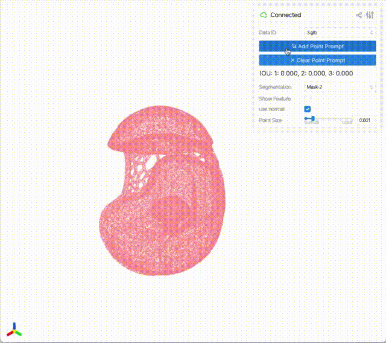

# P3-SAM: Native 3D Part Segmentation

**Changfeng Ma, Yang Li, Xinhao Yan, Jiachen Xu, Yunhan Yang, Chunshi Wang, Zibo Zhao, Yanwen Guo, Zhuo Chen, Chunchao Guo**

<div align="center">

[](https://arxiv.org/abs/2509.06784)
[](https://murcherful.github.io/P3-SAM/)
[](https://3d.hunyuan.tencent.com/studio)
[](https://3d.hunyuan.tencent.com)
[](https://yanxinhao.github.io/Projects/X-Part/)

</div>

Segmenting 3D assets into their constituent parts is crucial for enhancing 3D understanding, facilitating model reuse, and supporting various applications such as part generation. However, current methods face limitations such as poor robustness when dealing with complex objects and cannot fully automate the process. In this paper, we propose a native 3D point-promptable part segmentation model termed P3-SAM, designed to fully automate the segmentation of any 3D objects into components. Inspired by SAM, P3-SAM consists of a feature extractor, multiple segmentation heads, and an IoU predictor, enabling interactive segmentation for users. We also propose an algorithm to automatically select and merge masks predicted by our model for part instance segmentation. Our model is trained on a newly built dataset containing nearly 3.7 million models with reasonable segmentation labels. Comparisons show that our method achieves precise segmentation results and strong robustness on any complex objects, attaining state-of-the-art performance.


### TODO List 
- [X] Realse the paper.
- [X] Realse the code.
- [X] Realse the pre-trained models.

### Install 
1.  We recommend using a virtual environment to install the required packages. 

2. Our code is tested on Python 3.10, PyTorch 2.4.0+cu121 and CUDA 12.1. You can install them according to your system.

3. Install the required packages of [Sonata](https://github.com/facebookresearch/sonata).

4. Then you can install the package by running:
    ```
    pip install viser fpsample trimesh numba gradio
    cd utils/chamfer3D
    python setup.py install
    cd ../..
    ```

### Inference
1. Our demo will automatically download the pre-trained models from huggingface. You can also download `p3sam.ckpt` manually from the [link](https://huggingface.co/tencent/Hunyuan3D-Part) and put it in the `weights` folder.
2. Run the following command to automantically generate the masks:
    ```
    cd demo
    python auto_mask.py --ckpt_path ../weights/last.ckpt --mesh_path assets/1.glb --output_path results/1
    python auto_mask.py --mesh_path assets --output_path results/all
    
    python auto_mask_no_postprocess.py --ckpt_path ../weights/last.ckpt --mesh_path assets/1.glb --output_path results/1
    python auto_mask_no_postprocess.py --mesh_path assets --output_path results/all
    ```
3. Or you can run the following command to open a web app to interactively generate the mask given a point prompt:
    ```
    cd demo
    python app.py --ckpt_path ../weights/last.ckpt --data_dir assets
    ```
    
4. Or you can run the following command to open a gradio app to automantically generate the masks:
    ```
    cd demo
    python gradio_demo.py 
    ```
    


### Citation
```
@misc{ma2025p3sam,
      title={P3-SAM: Native 3D Part Segmentation}, 
      author={Changfeng Ma and Yang Li and Xinhao Yan and Jiachen Xu and Yunhan Yang and Chunshi Wang and Zibo Zhao and Yanwen Guo and Zhuo Chen and Chunchao Guo},
      year={2025},
      eprint={2509.06784},
      archivePrefix={arXiv},
      primaryClass={cs.CV},
      url={https://arxiv.org/abs/2509.06784}, 
}
```